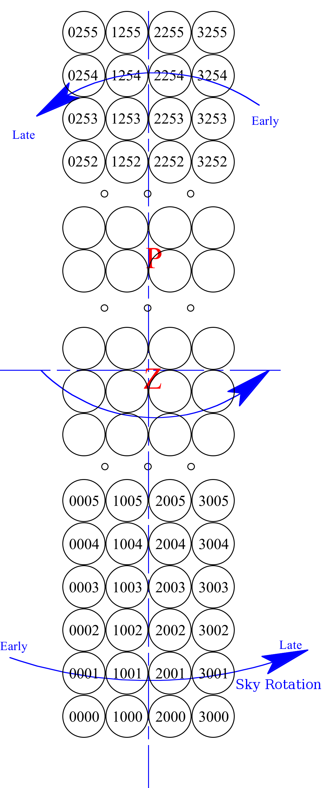
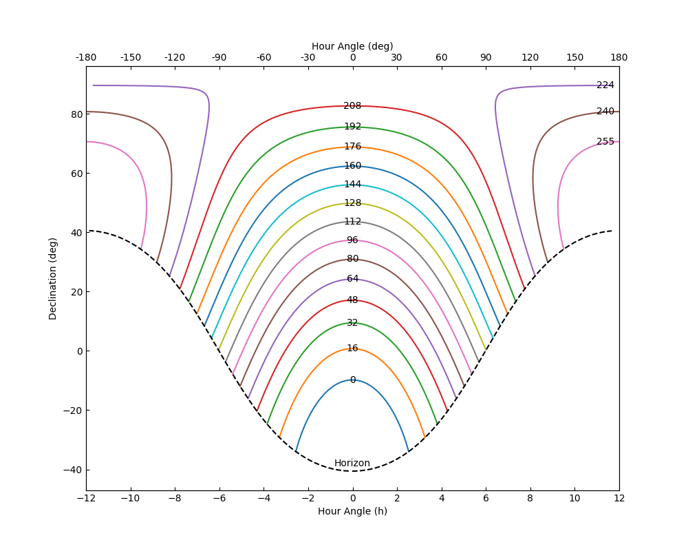
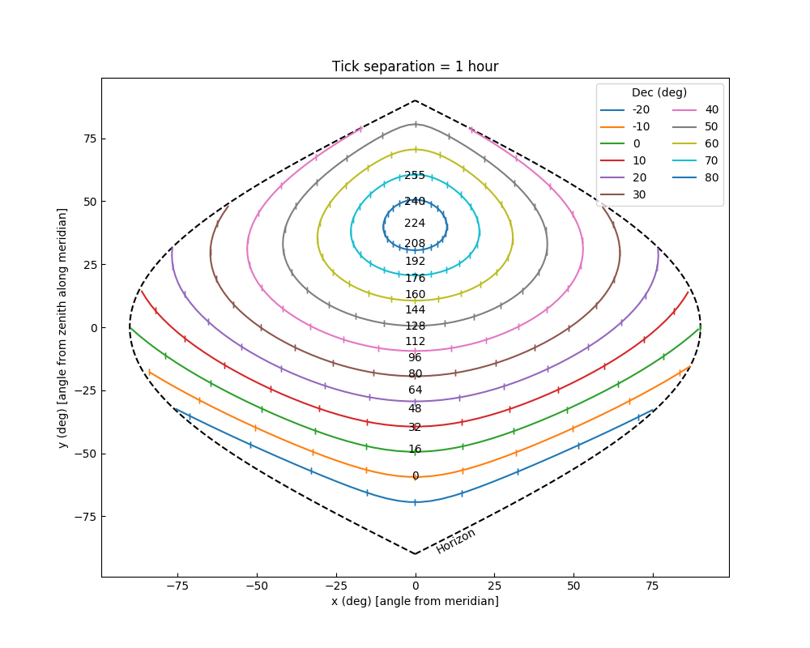
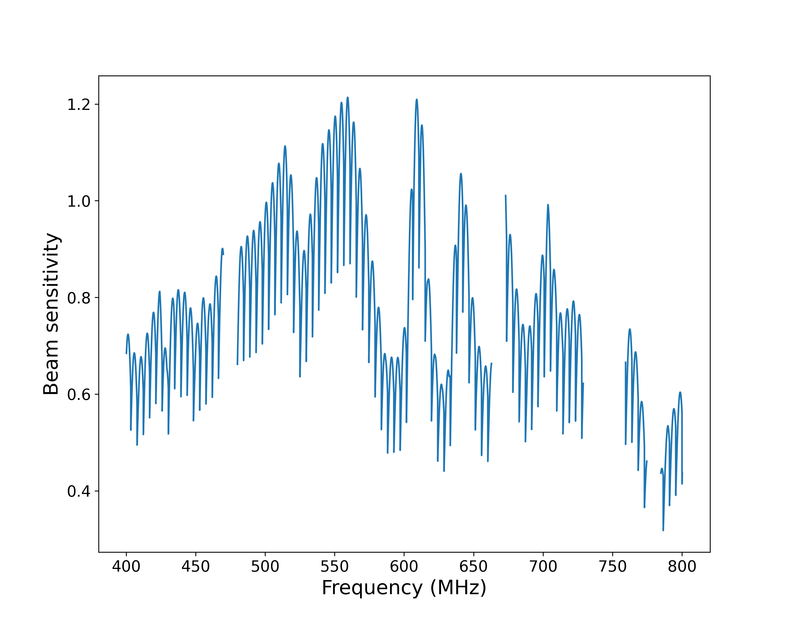

*Authors: Paul Scholz, Marcus Merryfield*

The beam model used for various analyses in the First CHIME/FRB Catalog is now available to download. The instructions for installation may be found in the CHIME/FRB beam model [GitHub repository](https://github.com/chime-frb-open-data/chime-frb-beam-model). This tutorial will guide the user on some useful routines the beam model can perform. Note that this release of the beam model only encompasses the version used for analysis in the First CHIME/FRB Catalog. The CHIME primary beam model is still being improved (see e.g. https://arxiv.org/abs/2201.11822), and as such the CHIME/FRB composite beam model (which includes both the CHIME/FRB synthesized FFT beams and the CHIME primary beam) will likely be updated in the future.

## Coordinate Conventions

Before getting started with the CHIME/FRB beam model, it is useful to understand the coordinate convention used:

- In the grid we use x and y as coordinates which are angles in degrees from the origin.
- As an origin, (x,y)=(0,0), we use the zenith, which the beam grid is centered on.
- With zenith as the origin, y is degrees north from zenith and x is degrees west from the meridian (i.e. increasing hour angle).

These coordinates were chosen based on how L0 forms beams:

- The four rows of NS beams will be parallel to meridian
    - The spacings of rows are arbitrary, and we have freedom of where to put them

- Beams will be spaced in each row as a function of zenith angle, ZA
    - Within each row of 256 beams the spacings are fixed based on the FFT (spaced evenly in `sin(ZA)`)

Beams IDs are numbered so that the first digit is the S-N running column (i.e 0-3) and the next three digits are the E-W running column.

- Beam 0001 is the most south-east beam (Beams X000 are used to process the incoherent beam)
- Beam 0255 is the most north-east beam
- Beam 3001 is the most south-west beam
- Beam 3255 is the most north-west beam


*Diagram of beam labelling. Z denotes the location of zenith in the grid and P denotes the North Celestial Pole. Credit: Mark Halpern*

The transformation between equatorial coordinates and beam coordinates is shown most clearly when mapping arcs of constant *y*/*Dec* map onto equatorial/beam model coordinates, respectively.


*Arcs of constant y in equatorial coordinates. Each plotted arc corresponds to the center of a
beam row that is labelled with its NS index. The horizon is represented by a dashed line. Credit: Paul Scholz*

Some things to note about the above plot:

- Since the synthesized beams in the EW direction (where CHIME has only 4 elements forming
interferometric baselines) have significant sidelobe structure that is not as suppressed as in the NS
direction (where CHIME has 256 elements), these arcs are a representation of the strip of the sky
a given beam row is sensitive to.
- The arcs of constant *y* arc downwards in declination as one moves away from the meridian. That
means that the sidelobes of beams are always sensitive to sources at lower declination than their
nominal positions.


*Arcs of constant declination in beam grid coordinates. Each arc corresponds to a declination
shown in the legend. Tick marks on the arcs represent the distance a source travels in an hour. The
location of beam rows are shown on the meridian as their NS indexes. The horizon is represented by a
dashed line. Credit: Paul Scholz*

Some things to note about the above plot:

- At high declinations, sources spend a lot of time within the beam grid, (and thus the main lobe
of the telescope primary beam) and so we have a large amount of exposure time near the North
Celestial Pole (NCP).
- Near the NCP, RA changes very rapidly for small separations on the sky. For example, at decl. = 85◦
(∼beam row 214), beam columns 0 and 3 are separated by 15◦ (1 hour) in RA.
- Sources on the sky that are detected outside of the beam grid will always appear at y’s higher than
during their transits. This can be seen in Figure 2 where the declination arcs turn upwards. This
means that sidelobe detections will occur at higher beam rows than at transit and their localizations
will assign a higher declination than the actual source.

## Generating beam model sensitivities

When generating sensitivities from the CHIME/FRB beam model, there are three important inputs to `get_sensitivity`. The first is the length `N` array of beam numbers for which you want to calculate sensitivities. The second is the `(M,2)` array of beam model `(x,y)` coordinate positions for which you want to calculate sensitivities. The last is the length `K` array of frequencies for which to calculate sensitivities. The returned array of sensitivities has shape `(M,N,K)`. 

In the following example, we'll calculate sensitivities for a single beam, at one coordinate position, and for all 16384 CHIME/FRB frequencies. Note that some frequencies in the beam model cannot be appropriately modeled due to interference. This normally isn't an issue, since the missing frequencies are also masked in detected FRBs. However, in cases where you wish to interpolate through these otherwise missing "bad frequencies", the `interpolate_bad_freq` option is available.

**Hint:** to get the most accurate CHIME/FRB-specific values, use the `chime-frb-constants` package, installable via `pip install chime-frb-constants`.

???+ Example "Beam coordinates"
    ```python
    import numpy as np
    import chime_frb_constants
    import cfbm

    # First create a beam model object of the CHIME/FRB composite beam model
    bm = cfbm.CompositeBeamModel(interpolate_bad_freq=False)

    # First choose a beam number (here we'll use only one)
    beam_no = [1064]

    # Next choose a position in the beam. We'll use the center of our chosen beam
    # at 600 MHz (note the beam shape & size change as a function of frequency)
    pos = bm.get_beam_positions(beam_no, freqs=[600])

    # In this example, squeeze the unused array dimensions, as get_beam_positions 
    # returns an NxMx2 array where N is the length of the beam number array and M 
    # is the length of the frequencies array
    pos = np.squeeze(pos)

    # The last ingredient is a list of frequencies: we'll get beam sensitivities
    # for all 16k frequencies in chime_frb_constants
    freqs = chime_frb_constants.FREQ

    # Finally, calculate the sensitivities
    sensitivities = bm.get_sensitivity(beam_no, pos, freqs)

    # Once again, in this example we'll squeeze unused array dimensions
    sensitivities = np.squeeze(sensitivities)
    
    # Now we have our array of sensitivities representing the beam sensitivity in
    # beam 1064, at 16384 frequencies from 400 to 800 MHz, and at the position of the
    # 600 MHz beam center!
    ```

Oftentimes you may want to calculate sensitivities like in the above example, but for (RA, Dec) pairs instead of beam model coordinate pairs. Fortunately there are functions in `cfbm` to convert between beam model coordinates and sky coordinates given a datetime. `cfbm.get_equatorial_from_position` converts beam position to equatorial coordinates given a time, and `cfbm.get_position_from_equatorial` does the reverse.

???+ Example "Sky coordinates"
    ```python
    from datetime import datetime
    import numpy as np
    import chime_frb_constants
    import cfbm

    # Create a beam model, choose a beam number, and generate the frequencies as before
    bm = cfbm.CompositeBeamModel(interpolate_bad_freq=False)
    beam_no = [1064]
    freqs = chime_frb_constants.FREQ

    # Setting the RA and Dec coordinates, choosing a time, and getting the corresponding
    # x and y coordinates
    ra = 370.7
    dec = 24.0
    t = datetime(year=2022, month=1, day=1)
    x, y = cfbm.get_position_from_equatorial(ra, dec, t)
    pos = np.array([x,y])

    # Finally, get the beam sensitivities with the (x,y) position and squeeze
    # unused dimensions
    sensitivities = bm.get_sensitivity(beam_no, pos, freqs)
    sensitivities = np.squeeze(sensitivities)
    ```


*A plot of the sensitivities generated in the first example. Credit: Marcus Merryfield*

The output sensitivities from the beam model range from 0 to slightly above 1. The value can be interpreted as the relative sensitivity compared to the center of the CHIME primary beam.