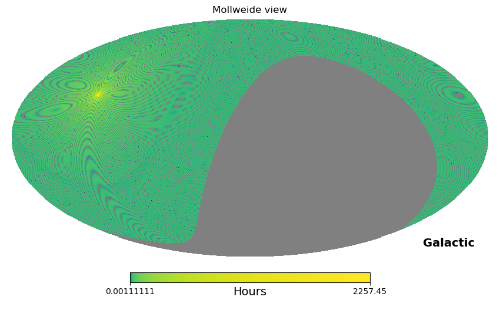

*Author: Pragya Chawla*


Below we provide a sample script for creating an exposure map from CHIME/FRB Catalog 1 Data. This example uses the healpy package to project the exposure map onto the 2D plane and serves as an example tp create both a high and low resolution exposure maps.

This utility is also provided through the [CHIME/FRB Open Data](https://github.com/chime-frb-open-data/chime-frb-open-data) python project.

???+ info ":fontawesome-brands-python: cfod"

    ```python
    from cfod.analysis import exposure
    fname = "exposure_int_20180828_20191001_transit_U_beam_FWHM-600_res_4s_0.86_arcmin.npz"
    exposure.render(filepath=fname)
    ```





???+ Example "Creating an exposure map for both upper and lower transits"

    ```python
    import numpy as np
    import matplotlib.pyplot as plt
    import healpy as hp
    from astropy.coordinates import SkyCoord
    import astropy.units as u

    fname_u = "exposure_int_20180828_20190702_transit_L_beam_FWHM-600_res_4s_0.86_arcmin.npz" #Upper Transit
    fname_l = "exposure_int_20180828_20190702_transit_U_beam_FWHM-600_res_4s_0.86_arcmin.npz" #Lower Transit

    with np.load(fname_u) as data:
        exposure = data["exposure"]
    
    #setting parameters for map resolution 

    # spatial
    nside = 4096
    npix = hp.nside2npix(nside)

    # temporal
    t_res = 4 
    
    # Initializing a healpy map
    hpxmap = np.zeros(npix, dtype=np.float) 
    hpxmap[0:len(exposure)] += t_res * exposure/(3600.) #seconds to hours
    hpxmap[hpxmap==0] = hp.UNSEEN #masking pixels with zero exposure
    
    # Plotting
    hp.mollview(hpxmap, coord=['C','G'], norm='log', unit="Hours")
    # Check exposure time in hours for FRB 20121102A
    coord = SkyCoord("05:31:58.70", "+33:08:52.5", frame='icrs', unit = u.deg)
    print("Exposure (in hours): %.2f"%hpxmap[hp.ang2pix(nside, coord.ra.deg, coord.dec.deg,  lonlat=True)])


    ### Obtaining a lower resolution map ###
    nside_out = 1024 
    print("Resolution of new map : %.2f arcmin"%(hp.nside2resol(nside_out, arcmin=True)))
    # Degrade healpix resolution to nside_out
    hpxmap_dg = hp.ud_grade(hpxmap, nside_out) 
    hp.mollview(hpxmap_dg, coord=['C','G'], norm='log', unit="Hours")
    ```

???+ hint

    - `nside_out` Varying nside_out parameter below will change the resolution. The nside parameter for the current map is 4096. You can switch to a lower value. However, do not use an nside lower than 512 as you would not be nyquist sampling the CHIME/FRB beam pattern in that case.
    - `hpxmap` Your HEALpix map will live here.
    - `hpxmap_dg` Your downgraded HEALpix map will live here.
    - `hp.mollview` Plots a Mollweide projection of your HEALpix map.
