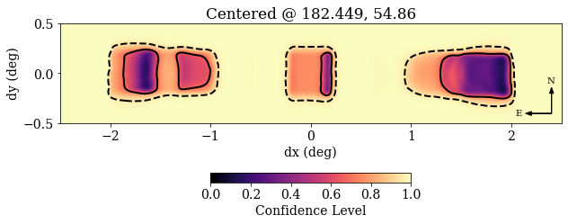
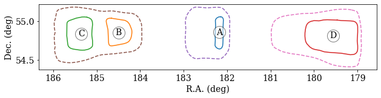

*Author: Alex Josephy*

Localizations are key to understanding FRBs and this tutorial will show you how to plot localizations from CHIME/FRB Catalog Data.

All of the code provided in this tutorial, is also availaible through the [CHIME/FRB Open Data](https://github.com/chime-frb-open-data/chime-frb-open-data) python package.

???+ info ":fontawesome-brands-python: cfod"

    ```python
    from cfod.routines import localizer
    localize = localizer.Localize(filename=`FRB20180725A_localization.h5`)
    localize.plot()
    localize.countours()
    ```

Following Python packages are required complete this tutorial: *h5py*, *numpy*, *healpy*, and *matplotlib*. 

## Loading in localization data
The localization data are stored in an HDF5 format. We include various views of the underlying probability distribution, which should be useful for different situations (e.g. healpix maps, contours lists). 

???+ Example

    ```python
    # Load in packages
    import h5py as h5
    import numpy as np
    import healpy as hp
    import matplotlib.pyplot as plt
    
    # Load in the HDF5 file.
    f = h5.File('example.h5', 'r')

    # The following function just summarizes the HDF5 file structure:
    def describe(group, recurse=False):
        """ Prints info on the contents of an hdf5 group """

        print(group.name)

        # First print header-like attributes (if exist)
        if group.attrs:
            print('\n  attrs: {')
        for key, value in group.attrs.items():
            if key in ['comments', 'history']:
                print('    %s:' % key)
                for line in value:
                    print('      ' + str(line))
            else:
                print('    %s:' % key, value)
        if group.attrs:
            print('  }')
        
        # Then print constituent groups & datasets
        print()
        for key, value in group.items():
            if isinstance(value, h5.Group):
                if recurse:
                    print('-'*60)
                    describe(value, True)
                else:
                    print('  ' + key + '/')
            else:
                print('  ' + key + ':', value.shape, value.dtype)
        print()
    ```
## ROOT Attributes
The attributes at the root level include some basic parameters: TNS name, the positional values reported in the Catalog table, coordinate system details, and galactic coordinates for convenience.

???+ Example "ROOT"

    ```
    describe(f['/']) # See hint 1
    f['healpix'].attrs['comments'] # See hints below
    ```

??? Hint

    ```
    The output from the first line above should be:
      attrs: {
        tns_name: FRB20181224D
        ra: 182.45
        ra_hms: 12h09m48s
        ra_error: 0.197
        dec: 54.85
        dec_dms: 54d51m00s
        dec_error: 0.213
        glon: 135.42455191200924
        glat: 61.256833554798746
        frame: ICRS
        epoch: J2000
        units: degrees
        comments:
          Reported errors are at the 68% CL.
          R.A. errors have been scaled by cos(dec).
          Regions reported here are for the mainlobe island.
          See further data products for sidelobe islands.
      }
    healpix/
    projection/
    contours/
    ```

??? Hint

    ```
    The output from the second line above should be:
    array(['Sparse representation of a HEALPix map.',
           'ipix := pixel indices (given nside and ordering scheme).',
           'CL := confidence level. Any pixel with a CL less than',
           '0.XX is within the XX% credible region.'], dtype=object)
    ```

## HEALPix
A sparse representation of a HEALPix map, where pixels with effectively zero probability have been discarded (typically ~99.99% of the sky). The same resolution is used as the exposure maps (nside = 4096, giving a pixel area of ~0.7 square arcmins).

???+ Example "HEALPix"

    ```
    describe(f['/healpix'])
    ```

??? Hint

    The output from the line above should be.
    ```
    /healpix
    
      attrs: {
        nside: 4096
        ordering: nested
        comments:
          Sparse representation of a HEALPix map.
          ipix := pixel indices (given nside and ordering scheme).
          CL := confidence level. Any pixel with a CL less than
          0.XX is within the XX% credible region.
      }
    
      ipix: (174835,) int64
      CL: (174835,) float32
    ```

### Sampling the Localization Region

???+ Example "Example usage of HEALPix"
    ```
    nside = f['healpix'].attrs['nside']
    ipix, CL = f['healpix/ipix'][()], f['healpix/CL'][()]
    
    # example 1: get locations of pixels within 90% confidence bounds
    # note that initializing the full healpix map is not necessary here
    ra, dec = hp.pix2ang(nside, ipix[CL < 0.9], nest=True, lonlat=True)
    
    # example 2: sampling pixels with weighting
    sampled = np.random.choice(ipix, 30000, p=(1-CL)/(1-CL).sum())
    ra, dec = hp.pix2ang(nside, sampled, nest=True, lonlat=True)    
    ```

### PROJECTION
A Gnomonic projection of the HEALPix map is included for convenient visualization. This projection method projects from the sphere onto a tangent plane, where the tangent point is centered on the target location. This is an appropriate choice given the ~degree scale of these uncertainty regions. The tangent plane that defines the projection is centered on the highest S/N beam.

???+ Example "PROJECTION"

    ```
    describe(f['/projection'])
    ```

??? Hint

    ```
    /projection
    
      attrs: {
        clon: 182.44863891601562
        clon_hms: 12h09m48s
        clat: 54.858444213867195
        clat_dms: 54d51m30s
        reso: 0.5
        xsize: 600
        ysize: 120
        comments:
          Gnomonic projection of the HEALPix map,
          centered around the beam with the highest S/N.
          Made  with healpy.projector.GnomonicProj
      }
    
      data: (120, 600) float32
    ```

### Making a Localization Plot

???+ Example

    ```python
    hdr = f['projection'].attrs
    CL = f['projection/data'][:]
    extent = np.array([-hdr['xsize']/2, hdr['xsize']/2, 
                        -hdr['ysize']/2, hdr['ysize']/2])*hdr['reso']/60
    
    plt.rc('font', family='serif', size=14)
    plt.figure(figsize=(10, 4))
    
    # Note: RA increases to the left!
    im = plt.imshow(CL, vmin=0, origin='lower',
                    extent=extent, cmap='magma')
    plt.contour(CL, levels=[0.68, 0.95], linestyles=['-', '--'], 
                colors='k', linewidths=2, extent=extent)
    
    plt.colorbar(im, pad=0.25, shrink=0.4, orientation='horizontal',
                    label='Confidence Level')
    plt.arrow(2.4, -0.4, 0, 0.2, head_width=0.04, color='k')
    plt.text(2.39, -0.1, 'N', ha='center', size=10)
    plt.arrow(2.4, -0.4, -0.2, 0., head_width=0.04, color='k')
    plt.text(2.1, -0.4, 'E', va='center', ha='right', size=10)
    plt.title('Centered @ %.3f, %.2f' % (hdr['clon'], hdr['clat']))
    plt.xlabel('dx (deg)')
    plt.ylabel('dy (deg)')
    ```
Your plot generated from the above script should look similar to this plot:


### Contours

???+ Example

    ```
    describe(f['/contours'], recurse=True)
    ```

??? Hint
    
    The above example's output should look like the following:

    ```
    /contours
    
      attrs: {
        comments:
          (R.A., Dec.) contours of common confidence intervals.
          Islands (labelled ABC...) are ordered with increasing R.A.
          Contours are extracted from the Gnomonic projection,
          and have been simplified using the Ramer-Douglas-Peucker
          algorithm (with an epsilon parameter of 0.2 pixels).
      }
    
    ------------------------------------------------------------
    /contours/50
    
      A: (2, 22) float32
      B: (2, 30) float32
      C: (2, 38) float32
    
    ------------------------------------------------------------
    /contours/68
    
      A: (2, 24) float32
      B: (2, 28) float32
      C: (2, 34) float32
      D: (2, 43) float32
    
    ------------------------------------------------------------
    /contours/90
    
      A: (2, 34) float32
      B: (2, 51) float32
      C: (2, 46) float32
    
    ------------------------------------------------------------
    /contours/95
    
      A: (2, 41) float32
      B: (2, 54) float32
      C: (2, 48) float32

    ```

### Making a Contour Plot¶

???+ Example
    
    ```python
    # example 0: getting points
    ra, dec = f['contours/68/A']
    
    # example 2: plotting contours
    plt.figure(figsize=(10,2))
    
    for name, contour in f['contours/68'].items():
        contour = contour[:]
        plt.plot(*contour)
        plt.plot(*contour.mean(1), 'wo', mec='k', ms=20, alpha=0.5)
        plt.text(*contour.mean(1), s=name, ha='center', va='center')
    for contour in f['contours/95'].values():
        plt.plot(*contour[:], '--')
    
    plt.xlim(*plt.xlim()[::-1])
    plt.xlabel('R.A. (deg)')
    plt.ylabel('Dec. (deg)')
    ```

Your plot generated from the above script should look similar to this plot:
