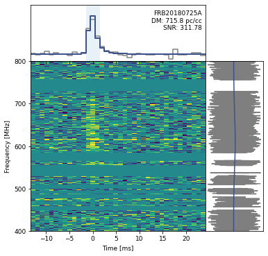

# CHIME/FRB Waterfall Data

*Author: Pranav Sanghvi*

This tutorial will help you get aquainted with the CHIME/FRB Catalog waterfall data. In this tutorial, the data file `FRB20180725A_waterfall.h5` was used, which contains data for FRB 20180725A. This data can be downloaded from the [CHIME/FRB Open Data Release](https://www.cadc-ccda.hia-iha.nrc-cnrc.gc.ca/files/vault/AstroDataCitationDOI/CISTI.CANFAR/21.0007/data/waterfalls/data/FRB20180725A_waterfall.h5). To download additional data, visit the [Canadian Astronomy Data Center](https://www.canfar.net/storage/list/AstroDataCitationDOI/CISTI.CANFAR/21.0007/data).

All of the code provided in this tutorial, is also availaible through the [CHIME/FRB Open Data](https://github.com/chime-frb-open-data/chime-frb-open-data) python package.

???+ info ":fontawesome-brands-python: cfod"

    ```python
    from cfod.routines import waterfaller
    wfall = Waterfaller(filename=`FRB20180725A_waterfall.h5`)
    wfall.plot()
    wfall.cal_plot(savepath="/some/path")
    ```

## Read hdf5 files

The user can use the `file_name` variable to store the name of the file that contains the FRB data to be analyzed. Be sure to follow the instructions for downloading the `hdf5` file for each FRB as desrcibed above. The file should be placed in the same directory as this notebook, or the full path should be specified in `file_name`.

???+ Example

    ```python
    file_name = "FRB20180725A_waterfall.h5"
    data = h5py.File(file_name, "r")
    ```

### Explore the data files

???+ Example "File Contents"

    ```python
    list(data.keys())
    >>> ['frb']
    ```

???+ "Metadata"

    ```python
    list(data["frb"].keys())
    >>> ['calibrated_wfall',
    'extent',
    'model_spec',
    'model_ts',
    'model_wfall',
    'plot_freq',
    'plot_time',
    'spec',
    'ts',
    'wfall']
    ```

??? Hint "Metadata Description"

    - `extent`: the extent of the waterfall data 
    - `plot_freq`: The values of the frequecy indices in $\rm{MHz}$
    - `plot_time`: The value of the time indices in $\rm{\mu s}$
    - `wfall`: waterfall data
    - `model_wfall`: waterfall from fitted data 
    - `spec`: Dynamic Spectrum
    - `model_spec`: model-fitted dynamic spectrum  
    - `ts`: time series data
    - `model_ts`: model-fitted time series 
    - `caliberated_wfall`: The waterfall data with calibration applied

???+ Example "Unpack the Data"

    ```python
    data = data["frb"]
    eventname = data.attrs["tns_name"].decode()
    wfall = data["wfall"][:]
    model_wfall = data["model_wfall"][:]
    plot_time = data["plot_time"][:]
    plot_freq = data["plot_freq"][:]
    ts = data["ts"][:]
    model_ts = data["model_ts"][:]
    spec = data["spec"][:]
    model_spec = data["model_spec"][:]
    extent = data["extent"][:]
    dm = data.attrs["dm"][()]
    scatterfit = data.attrs["scatterfit"][()]
    cal_obs_date = data.attrs["calibration_observation_date"].decode()
    cal_source_name = data.attrs["calibration_source_name"].decode()
    cal_wfall =  data["calibrated_wfall"][:]

    dt = np.median(np.diff(plot_time)) # the delta (time) between time bins 
    # this value is the same for both caliberated and uncalibrated data
    ```

## Removing the Radio Frequency Interference
This process sets any frequency channel that has a higher variance than the mean variance (averaged across all frequency channels) to a `NaN` value using `np.nan`. 

???+ Example "RFI Removal"

    ```python
    q1 = np.nanquantile(spec, 0.25)
    q3 = np.nanquantile(spec, 0.75)
    iqr = q3 - q1

    # additional masking of channels with RFI
    rfi_masking_var_factor = 3

    channel_variance = np.nanvar(wfall, axis=1)
    mean_channel_variance = np.nanmean(channel_variance)

    with np.errstate(invalid="ignore"):
        rfi_mask = (channel_variance > \
                    rfi_masking_var_factor * mean_channel_variance) \
                    | (spec[::-1] < q1 - 1.5 * iqr) | (spec[::-1] > q3 + 1.5 * iqr)
    wfall[rfi_mask,...] = np.nan
    model_wfall[rfi_mask,...] = np.nan
    spec[rfi_mask[::-1]] = np.nan

    # remake time-series after RFI masking
    ts = np.nansum(wfall, axis=0)
    model_ts = np.nansum(model_wfall, axis=0)
    ```

## Determine the Peaks and SNR of the Pulse

Peaks are identified after boxcar convolution.

???+ Example "Pulse Properties"

    ```python
    def boxcar_kernel(width):
        width = int(round(width, 0))
        return np.ones(width, dtype="float32") / np.sqrt(width)


    def find_burst(ts, min_width=1, max_width=128):
        min_width = int(min_width)
        max_width = int(max_width)
        # do not search widths bigger than timeseries
        widths = list(range(min_width, min(max_width + 1, len(ts)-2)))
        # envelope finding
        snrs = np.empty_like(widths, dtype=float)
        peaks = np.empty_like(widths, dtype=int)
        for i in range(len(widths)):
            convolved = scipy.signal.convolve(ts, boxcar_kernel(widths[i]), mode="same")
            peaks[i] = np.nanargmax(convolved)
            snrs[i] = convolved[peaks[i]]
        best_idx = np.nanargmax(snrs)
        return peaks[best_idx], widths[best_idx], snrs[best_idx]
    ```
    ```
    peak, width, snr = find_burst(ts)
    print(f"Peak: {peak} at time sample, Width = {width*dt} ms, SNR = {snr}")
    ```

## Visualize the Dynamic Spectra
First and foremost, we need to bin the frequency data before we visualize it.

???+ Example "Bin Frequency Data"

    ```python
    def bin_freq_channels(data, fbin_factor=4):
        num_chan = data.shape[0]
        if num_chan % fbin_factor != 0:
            raise ValueError("frequency binning factor `fbin_factor` should be even")
        data = np.nanmean(data.reshape((num_chan // fbin_factor, fbin_factor) + data.shape[1:]), axis=1)
        return data
    ```
    ```python
    # bin frequency channels such that we have 16,384/16 = 1024 frequency channels 
    wfall = bin_freq_channels(wfall, 16)
    ```

???+ Example "Plot the Dynamic Spectrum"

    ```python
    fig = plt.figure(figsize=(6,6))
    ## Set up the image grid
    gs = gridspec.GridSpec(ncols=2, nrows=2, figure=fig, width_ratios=[3, 1],
                            height_ratios=[1, 3], hspace=0.0, wspace=0.0)
    data_im = plt.subplot(gs[2])
    data_ts = plt.subplot(gs[0], sharex=data_im)
    data_spec = plt.subplot(gs[3], sharey=data_im)


    ### time stamps relative to the peak
    peak_idx = np.argmax(ts)
    extent[0] = extent[0] - plot_time[peak_idx]
    extent[1] = extent[1] - plot_time[peak_idx]
    plot_time -= plot_time[peak_idx]

    # prepare time-series for histogramming
    plot_time -= dt / 2.
    plot_time = np.append(plot_time, plot_time[-1] + dt)

    cmap = plt.cm.viridis

    ### plot dynamic spectrum
    wfall[np.isnan(wfall)] = np.nanmedian(wfall)   # replace nans in the data with the data median
    # use standard deviation of residuals to set color scale
    vmin = np.nanpercentile(wfall, 1)
    vmax = np.nanpercentile(wfall, 99)

    data_im.imshow(wfall, aspect="auto", interpolation="none",
                    extent=extent, vmin=vmin, vmax=vmax, cmap=cmap)

    ### plot time-series
    data_ts.plot(plot_time, np.append(ts, ts[-1]), color="tab:gray",
                    drawstyle="steps-post")

    ### plot spectrum
    data_spec.plot(spec, plot_freq, color="tab:gray")

    ### plot model time-series and spectrum
    if scatterfit:
        data_spec.plot(model_spec, plot_freq, color=cmap(0.25))
        data_ts.plot(plot_time, np.append(model_ts, model_ts[-1]),
                        color=cmap(0.25), drawstyle="steps-post", lw=2)
    else:
        data_spec.plot(model_spec, plot_freq, color=cmap(0.5))
        data_ts.plot(plot_time, np.append(model_ts, model_ts[-1]),
                        color=cmap(0.5), drawstyle="steps-post", lw=1)


    ## BEautify plot
    # remove some labels and ticks for neatness
    plt.setp(data_ts.get_xticklabels(), visible=False)
    data_ts.set_yticklabels([], visible=True)
    data_ts.set_yticks([])
    data_ts.set_xlim(extent[0], extent[1])
    plt.setp(data_spec.get_yticklabels(), visible=False)
    data_spec.set_xticklabels([], visible=True)
    data_spec.set_xticks([])
    data_spec.set_ylim(extent[2], extent[3])
    plt.setp(data_im.get_xticklabels(), fontsize=9)
    plt.setp(data_im.get_yticklabels(), fontsize=9)


    #### highlighting the width of the pulse
    data_ts.axvspan(max(plot_time.min(),
                            plot_time[peak] + 0.5 * dt \
                            - (0.5 * width) * dt),
                        min(plot_time.max(),
                            plot_time[peak] + 0.5 * dt \
                            + (0.5 * width) * dt),
                        facecolor="tab:blue", edgecolor=None, alpha=0.1)


    ##### add event ID and DM labels
    xlim = data_ts.get_xlim()
    ylim = data_ts.get_ylim()

    # add 20% extra white space at the top
    span = np.abs(ylim[1]) + np.abs(ylim[0])
    data_ts.set_ylim(ylim[0], ylim[1] + 0.2 * span)
    ylim = data_ts.get_ylim()

    ypos = (ylim[1] - ylim[0]) * 0.9 + ylim[0]
    xpos = (xlim[1] - xlim[0]) * 0.98 + extent[0]
    data_ts.text(xpos, ypos, "{}\nDM: {:.1f} pc/cc\nSNR: {:.2f}".format(eventname, dm,snr), ha="right",
                    va="top", fontsize=9)

    data_im.locator_params(axis="x", min_n_ticks=3)
    data_im.set_yticks([400, 500, 600, 700, 800])
    data_im.set_ylabel("Frequency [MHz]", fontsize=9)
    data_im.set_xlabel("Time [ms]", fontsize=9)
    ```

    ```python
    #savefigure
    plt.savefig("{}_wfall.png".format(eventname), dpi=300,      bbox_inches="tight")
    ```

    

## Plotting Calibrated Data
Within the `hdf5` file is the calibrated waterfall data, allowing one to plot the data as measured in Janskys.

???+ Example " Extract the Waterfall and Construct the Time Series"
    ```python
    cal_ts = np.nanmean(cal_wfall, axis = 0)
    ```

    ```python
    cal_wfall[np.isnan(cal_wfall)] = np.nanmedian(cal_wfall)   # replace nans in the data with the data median
    #bin frequency channels such that we have 16,384/16 = 1024 frequency channels 
    cal_wfall = bin_freq_channels(cal_wfall,16) 
    vmin = np.nanpercentile(cal_wfall, 1)
    vmax = np.nanpercentile(cal_wfall, 99)

    times = np.arange(len(cal_ts))*dt
    peak_idx = np.argmax(cal_ts)
    times -= times[peak_idx]
    times -= dt / 2.

    extent[0] = times[0]
    extent[1] = times[-1]

    fig = plt.figure(figsize=(5,5), constrained_layout=True)
    layout = """
    A
    C
    """
    ax_dict = fig.subplot_mosaic(layout)
    ax_dict["A"].imshow(cal_wfall, aspect="auto", vmin=vmin,vmax=vmax, extent = extent )
    ax_dict["A"].set_title(f"Waterfall of {eventname} \n Calibrated to {cal_source_name} on {cal_obs_date}")
    ax_dict["A"].set_yticks([400, 500, 600, 700, 800])
    ax_dict["C"].plot(times,cal_ts, drawstyle="steps-post")
    ax_dict["C"].set_xlabel("Time [ms]")
    ax_dict["C"].set_title(f"Time Series of {eventname} \nCalibrated to {cal_source_name} on {cal_obs_date} \
            \n Peak flux = {cal_ts[peak_idx]:.3f} Jy")
    ax_dict["A"].set_ylabel("Frequency [MHz]")
    ax_dict["C"].set_ylabel("Flux [Jy]")
    ```

    